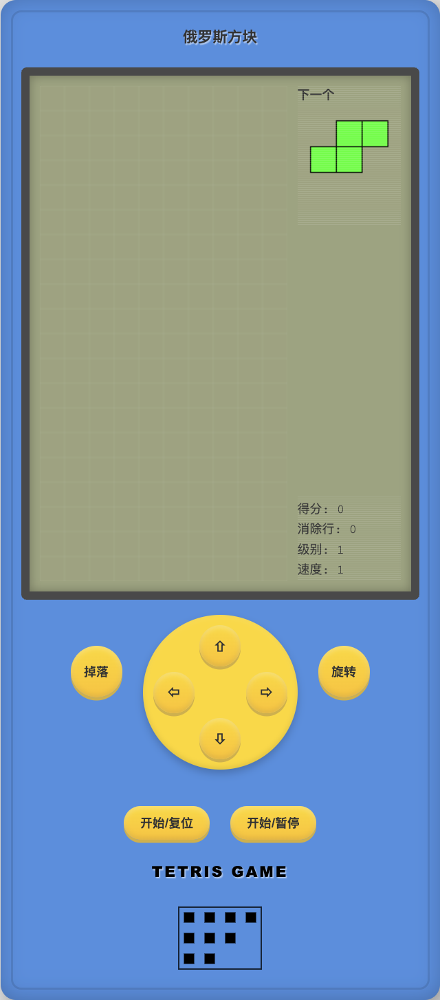

# TypeScript Tetris Game

A modern implementation of the classic Tetris game built with TypeScript and HTML5 Canvas.



## Features

- Classic Tetris gameplay with modern visuals
- Responsive controls for desktop
- Score tracking and level progression
- Speed increases as level advances
- Preview of the next piece
- Game pause and resume functionality
- Retro-styled game console UI

## Getting Started

### Prerequisites

- [Bun](https://bun.sh/) - Fast JavaScript runtime & package manager

### Installation

1. Clone the repository:
   ```bash
   git clone https://github.com/lucky845/ts-tetris-game.git
   cd ts-tetris-game
   ```

2. Install dependencies:
   ```bash
   bun install
   ```

3. Start the development server:
   ```bash
   bun run start
   ```

4. Build for production:
   ```bash
   bun run build
   ```

## Game Controls

- **←, →**: Move piece left/right
- **↓**: Move piece down
- **↑**: Rotate piece
- **Space**: Hard drop
- **P**: Pause/Resume game
- Or use on-screen controls

## Technical Details

- Written in TypeScript
- Rendered using HTML5 Canvas
- No external game libraries - built from scratch
- Bundled with Bun

## Project Structure

```
ts-tetris-game/
├── src/
│   ├── controllers/    # Game controllers
│   ├── models/         # Game logic and data models
│   ├── renderers/      # Rendering logic
│   └── index.ts        # Entry point
├── public/
│   ├── styles/         # CSS styles
│   └── index.html      # HTML template
├── dist/               # Compiled files
└── package.json        # Project configuration
```

## License

This project is licensed under the MIT License - see the [LICENSE](LICENSE) file for details.

## Acknowledgments

- Inspired by the original Tetris game
- Built with modern web technologies 